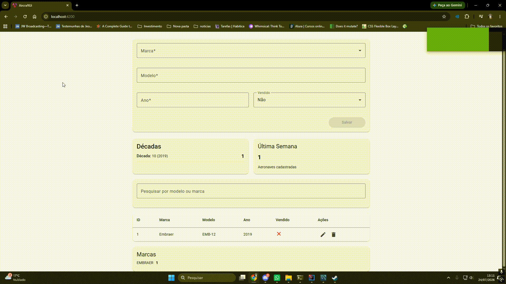
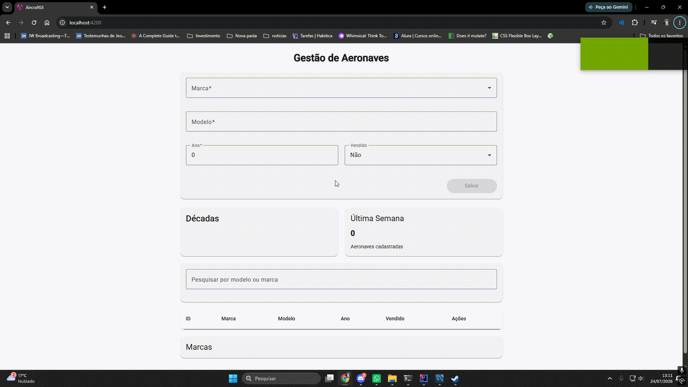
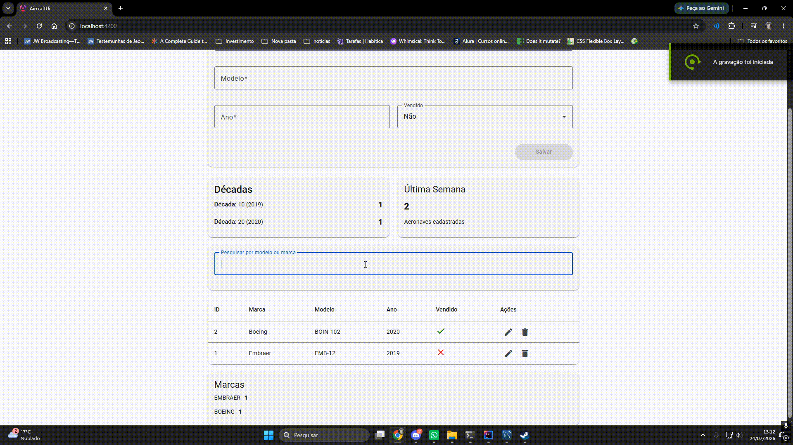
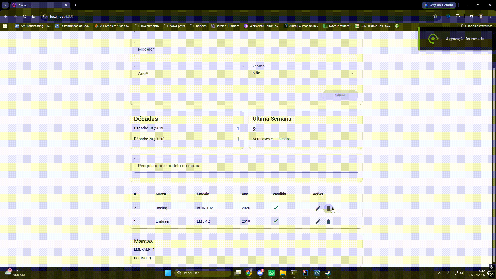

# Aircraft Management

Sistema desenvolvido como solução para o desafio técnico da **SONDA**, composto por uma API REST para gerenciamento de aeronaves e uma aplicação **SPA (Single Page Application)** desenvolvida em Angular.

---

# Tecnologias Utilizadas

## Backend

- Java 21
- Spring Boot
- Spring Data JPA
- MySQL
- Maven
- Bean Validation
- Swagger / OpenAPI

## Frontend

- Angular 20
- Angular Material
- TypeScript
- RxJS
- SCSS

---

# Estrutura do Projeto

```text
aircraft-management
│
├── .github
│
├── backend
│   ├── src
│   ├── pom.xml
│   └── ...
│
├── frontend
│   ├── src
│   ├── package.json
│   └── ...
│
├── imgs
│   ├── Busca.gif
│   ├── Criar.gif
│   ├── Delete.gif
│   └── Editar.gif
│
└── README.md
```

---

# Arquitetura

## Backend

O backend foi desenvolvido utilizando **Spring Boot**, seguindo uma arquitetura em camadas.

- Controllers
- Services
- Repositories
- DTOs
- Entities
- Enums
- Projections

A persistência dos dados é realizada utilizando **Spring Data JPA** juntamente com o banco de dados **MySQL**.

## Frontend

O frontend foi desenvolvido utilizando **Angular** seguindo o conceito de **Single Page Application (SPA)**.

A estrutura da aplicação está organizada em:

- Components
- Pages
- Services
- Interfaces compartilhadas

Toda comunicação entre frontend e backend é realizada através de requisições HTTP utilizando JSON.

---

# Funcionalidades

O sistema permite:

- Cadastro de aeronaves;
- Atualização de aeronaves;
- Exclusão de aeronaves;
- Consulta por ID;
- Pesquisa de aeronaves;
- Dashboard contendo:
  - Quantidade de aeronaves não vendidas;
  - Quantidade de aeronaves cadastradas na última semana;
  - Distribuição por fabricante;
  - Distribuição por década de fabricação;
- Validação dos fabricantes permitidos.

---

# Endpoints da API

| Método | Endpoint | Descrição |
|---------|----------|-----------|
| GET | `/aeronaves` | Lista todas as aeronaves. |
| GET | `/aeronaves/{id}` | Busca uma aeronave pelo ID. |
| GET | `/aeronaves/find?term={termo}` | Pesquisa aeronaves por termo. |
| GET | `/aeronaves/dashboard` | Retorna os indicadores do dashboard. |
| POST | `/aeronaves` | Cadastra uma nova aeronave. |
| PUT | `/aeronaves/{id}` | Atualiza uma aeronave existente. |
| DELETE | `/aeronaves/{id}` | Remove uma aeronave. |

---

# Exemplos de Requisições

## Criar Aeronave

### POST `/aeronaves`

#### Request

```json
{
  "nome": "737-800",
  "marca": "BOEING",
  "ano": 2018,
  "descricao": "Aeronave comercial para transporte de passageiros.",
  "vendido": false
}
```

#### Response (201)

```json
{
  "id": 1,
  "nome": "737-800",
  "descricao": "Aeronave comercial para transporte de passageiros.",
  "marca": "BOEING",
  "ano": 2018,
  "vendido": false,
  "createdAt": "2026-07-23T22:03:32.100Z",
  "updatedAt": "2026-07-23T22:03:32.100Z"
}
```

---

## Atualizar Aeronave

### PUT `/aeronaves/{id}`

#### Request

```json
{
  "nome": "737-800 NG",
  "marca": "BOEING",
  "ano": 2019,
  "descricao": "Versão atualizada da aeronave.",
  "vendido": true
}
```

#### Response (200)

```json
{
  "id": 1,
  "nome": "737-800 NG",
  "descricao": "Versão atualizada da aeronave.",
  "marca": "BOEING",
  "ano": 2019,
  "vendido": true,
  "createdAt": "2026-07-23T22:03:32.100Z",
  "updatedAt": "2026-07-23T22:15:10.523Z"
}
```

---

## Buscar Todas as Aeronaves

### GET `/aeronaves`

#### Response (200)

```json
[
  {
    "id": 1,
    "nome": "737-800",
    "descricao": "Aeronave comercial",
    "marca": "BOEING",
    "ano": 2018,
    "vendido": false
  },
  {
    "id": 2,
    "nome": "E195-E2",
    "descricao": "Jato regional",
    "marca": "EMBRAER",
    "ano": 2021,
    "vendido": true
  }
]
```

---

## Buscar Aeronave por ID

### GET `/aeronaves/1`

#### Response (200)

```json
{
  "id": 1,
  "nome": "737-800",
  "descricao": "Aeronave comercial",
  "marca": "BOEING",
  "ano": 2018,
  "vendido": false
}
```

---

## Pesquisar Aeronaves

### GET `/aeronaves/find?term=boeing`

#### Response (200)

```json
[
  {
    "id": 1,
    "nome": "737-800",
    "descricao": "Aeronave comercial",
    "marca": "BOEING",
    "ano": 2018,
    "vendido": false
  }
]
```

---

## Dashboard

### GET `/aeronaves/dashboard`

#### Response (200)

```json
{
  "unsold": 4,
  "registeredLastWeek": 2,
  "aircraftByMarca": [
    {
      "marca": "BOEING",
      "quantity": 3
    },
    {
      "marca": "EMBRAER",
      "quantity": 5
    }
  ],
  "aircraftByDecade": [
    {
      "label": "Década 1990",
      "quantity": 1
    },
    {
      "label": "Década 2000",
      "quantity": 3
    },
    {
      "label": "Década 2010",
      "quantity": 4
    }
  ]
}
```

---

## Excluir Aeronave

### DELETE `/aeronaves/{id}`

#### Response (204)

```text
No Content
```

---

# Pré-requisitos

Antes de executar o projeto, certifique-se de possuir os seguintes requisitos instalados.

## Backend

- Java 21
- Maven
- MySQL

## Frontend

- Node.js **v22.22.3** ou superior

> O Angular CLI requer uma das seguintes versões do Node.js:
>
> - v22.22.3
> - v24.15.0
> - v26.0.0 ou superior

Instale o Angular CLI globalmente:

```bash
npm install -g @angular/cli
```

Verifique as versões instaladas:

```bash
node -v
npm -v
ng version
```

---

# Configuração do Banco de Dados

O projeto utiliza **MySQL**.

Antes de iniciar o backend, é necessário criar o banco de dados.

Execute o seguinte comando no MySQL:

```sql
CREATE SCHEMA IF NOT EXISTS `aircraft`;
```

Após criar o banco, configure as variáveis de ambiente utilizadas pela aplicação.

No arquivo `application.properties`:

```properties
spring.datasource.url=${DB_URL}
spring.datasource.username=${DB_USERNAME}
spring.datasource.password=${DB_PASSWORD}
```

### Windows (PowerShell)

```powershell
$env:DB_URL="jdbc:mysql://localhost:3306/aircraft"
$env:DB_USERNAME="root"
$env:DB_PASSWORD="sua_senha"
```

### Linux / WSL

```bash
export DB_URL=jdbc:mysql://localhost:3306/aircraft
export DB_USERNAME=root
export DB_PASSWORD=sua_senha
```
---

# Como Executar

## 1. Clone o repositório

```bash
git clone git@github.com:Gabriel-Coutinho0/Gerenciamento-de-aeronave.git
```

Entre na pasta:

```bash
cd Gerenciamento-de-aeronave
```

---

## 2. Execute o Backend

```bash
cd backend
```

Windows

```bash
mvnw spring-boot:run
```

Linux / WSL

```bash
./mvnw spring-boot:run
```

A API ficará disponível em:

```
http://localhost:8080
```

Swagger:

```
http://localhost:8080/swagger-ui/index.html
```

---

## 3. Execute o Frontend

Abra outro terminal.

```bash
cd frontend
```

Instale as dependências:

```bash
npm install
```

Execute:

```bash
ng serve
```

A aplicação ficará disponível em:

```
http://localhost:4200
```

---

# Arquitetura da Solução

```text
                 Angular SPA
                      │
                 HTTP / JSON
                      │
             Spring Boot REST
                      │
             Spring Data JPA
                      │
                   MySQL
```

---

# Documentação da API

Após iniciar o backend, a documentação poderá ser acessada em:

```
http://localhost:8080/swagger-ui/index.html
```

---

# Demonstração

## Busca de Aeronaves

Listagem das aeronaves cadastradas e pesquisa por termo.



---

## Cadastro de Aeronave

Cadastro de uma nova aeronave.



---

## Atualização de Aeronave

Edição das informações de uma aeronave.



---

## Exclusão de Aeronave

Confirmação da exclusão de uma aeronave.



---

# Boas Práticas Adotadas

- Arquitetura em camadas;
- Spring Data JPA;
- Separação entre DTOs e entidades;
- Bean Validation;
- Componentização no Angular;
- Angular Material;
- Documentação automática utilizando Swagger/OpenAPI;
- Organização do código visando manutenção e reutilização.

---

# Considerações Finais

O projeto foi desenvolvido utilizando **Spring Boot** para o backend e **Angular** para o frontend, seguindo o conceito de **Single Page Application (SPA)**.

A solução foi estruturada visando organização, reutilização de código e facilidade de manutenção, implementando todos os requisitos propostos no desafio técnico, incluindo operações CRUD, pesquisa, dashboard consolidado e documentação da API.
